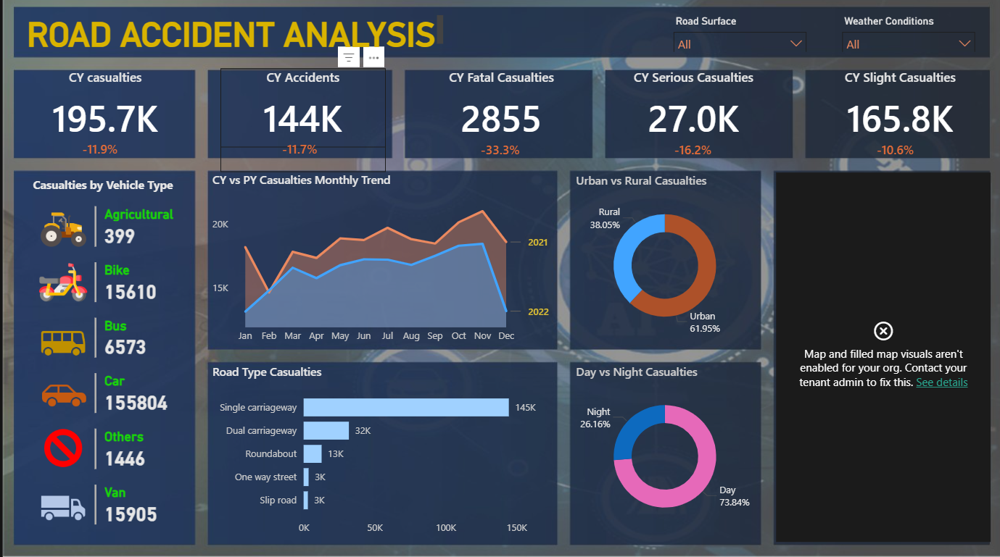

# Road Accident Analysis — Power BI Dashboard

## Project Overview
An end-to-end Power BI dashboard analysing road accident and casualty data across
2021 and 2022. The dashboard enables stakeholders — including traffic authorities,
transport planners, and safety teams — to monitor accident trends, identify high-risk
conditions, and compare year-on-year performance.

---

## Objectives
- Track total casualties and accidents for the current year (CY) vs previous year (PY)
- Break down casualties by severity: Fatal, Serious, and Slight
- Analyse casualties by vehicle type, road type, and location (Urban vs Rural)
- Identify patterns by time of day and filter by road surface and weather conditions

---

## Tools & Concepts Used
- **Microsoft Power BI** — dashboard design and data visualisation
- **Power Query** — data cleaning and transformation
- **DAX** — KPI measures and year-on-year calculations
- **Data Modelling** — table relationships in Power BI
- **PowerPoint** — custom dashboard background design
- **Slicers & Action Filters** — interactive filtering by Road Surface and Weather Conditions

---

## Dataset
The dataset contains UK road accident records for 2021 and 2022, including:
- Accident date, location (urban/rural), road type, road surface, and weather conditions
- Vehicle types involved
- Casualty severity: Fatal, Serious, Slight

**Period covered:** 2021 – 2022

---

## Dashboard KPIs

| Metric | CY Value | YoY Change |
|---|---|---|
| Total Casualties | 195.7K | -11.9% |
| Total Accidents | 144K | -11.7% |
| Fatal Casualties | 2,855 | -33.3% |
| Serious Casualties | 27.0K | -16.2% |
| Slight Casualties | 165.8K | -10.6% |

---

## Dashboard Visuals
- **Casualties by Vehicle Type** — icon-based breakdown (Car leads at 155,804)
- **CY vs PY Monthly Trend** — dual-line area chart comparing 2021 and 2022
- **Urban vs Rural Casualties** — donut chart (Urban 61.95% | Rural 38.05%)
- **Road Type Casualties** — bar chart (Single carriageway dominates at 145K)
- **Day vs Night Casualties** — donut chart (Day 73.84% | Night 26.16%)
- **Filters** — Road Surface and Weather Conditions slicers

---

## Key Insights
- Overall casualties and accidents declined year-on-year across all severity levels
- Fatal casualties saw the sharpest reduction at -33.3%
- Cars account for the vast majority of casualties at over 155K
- Single carriageways are the most dangerous road type by a significant margin
- Urban areas account for nearly 62% of all casualties
- Daytime accidents are far more frequent, making up nearly 74% of total casualties

---

## Screenshot

---

## How to View
1. Download the `.pbix` file from this repository
2. Open with [Microsoft Power BI Desktop](https://powerbi.microsoft.com/desktop/) (free)
3. Use the Road Surface and Weather Conditions slicers to filter the data interactively

---

## Notes
This project was built as part of my data analytics portfolio following a structured
beginner Power BI tutorial. It covers the full project workflow including requirement
gathering, data cleaning, modelling, background design in PowerPoint, and dashboard
build with interactive filters.
